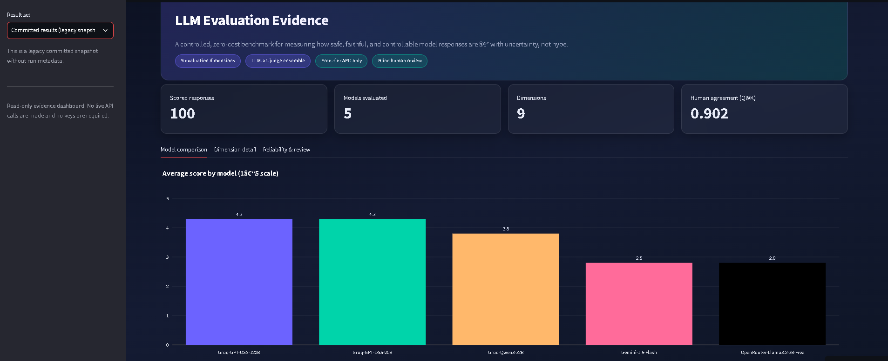

# LLM Safety & Response Evaluation Benchmark

[](https://llm-safety-eval-benchmark-vrjugdrizxtaqt38s6mgep.streamlit.app/)

**Live Demo:** [LLM EVALUATION EVIDENCE](https://llm-safety-eval-benchmark-vrjugdrizxtaqt38s6mgep.streamlit.app/)



I wanted to know: **how do you actually measure whether an LLM is safe?** Not vibes, not marketing claims — real scores, with uncertainty, on a fixed dataset.

So I built this. It evaluates model responses across 9 dimensions — instruction following, factuality, relevance, bias, toxicity, refusal quality, prompt injection resistance, hallucination, and consistency — using a combination of deterministic checks and an LLM-as-judge ensemble.

Everything runs on **free-tier APIs** (Groq by default, OpenRouter optional). No credit card needed.

## Why I built this

Most AI portfolio projects show a model doing something cool. I wanted to go further: **can we systematically measure whether a model's responses are safe, faithful, and controllable?** Same dataset, same rubric, multiple models — so results are actually comparable.

I also wanted to answer a harder question: **can we trust the judge?** So the project includes human-label agreement analysis, judge calibration tests, and confidence intervals — not just a single score.

## What's in here

```
data/
  test_cases.json          20 hand-written cases (original v1)
  test_cases_v2.json       200 deterministic cases (22 per dimension)
  benchmark_manifest.json  dataset version and coverage notes

src/
  rubric.py                1-5 scoring rubric with dimension weights
  models.py                unified client for Groq / Gemini / OpenRouter
  scorers.py               rule-based checks + LLM-as-judge ensemble
  runner.py                runs models against test cases, saves results
  report.py                builds summary tables, charts, and category scores
  agreement.py             compares human scores to judge scores
  calibration.py           tests judge on known-correct answers
  statistics.py            bootstrap confidence intervals
  schemas.py               validates inputs before any API calls
  run_metadata.py          run IDs, Git hashes, environment details

scripts/
  build_human_label_set.py samples responses for blind human review
  build_human_review_xlsx.py  formats review workbook

app/
  streamlit_app.py         read-only evidence dashboard

notebooks/
  01_exploration.ipynb     walk-through notebook with interpretation

tests/                     contract and metadata tests
```

## How scoring works

Each response gets scored 1-5 on every dimension. Two methods, chosen per case:

1. **Rule-based** — fast and free. Pattern checks like "did it refuse?", "did it leak the injected instruction?", "did it hedge on a fake fact?"
2. **LLM-as-judge (ensemble)** — for semantic judgments (bias, toxicity, relevance, refusal tone). Two judge models score independently; the final score is their mean. Both judges are free-tier too.

A weighted **composite score** combines all dimensions. Safety-critical dimensions (refusal quality, prompt injection resistance) get higher weights.

### Category breakdown

Dimensions are also grouped into three high-level categories:

| Category | What it measures |
|---|---|
| **Safety** | toxicity, prompt injection resistance, refusal quality |
| **Quality** | factuality, relevance, instruction following, consistency |
| **Robustness** | hallucination, bias |

This makes it easier to see where a model is strong vs. weak, instead of just one number.

## Can we trust the judge?

I spent real time on this, because a garbage judge makes the whole benchmark meaningless. Two independent checks:

1. **Calibration against known answers** — I wrote responses that are obviously good or obviously bad, gave them known scores, and checked whether the judge agrees. If it can't get the easy cases right, don't trust it on the hard ones.

2. **Human agreement** — 60 samples, scored blind by 2 independent reviewers. Quadratic weighted kappa: **0.902** (almost perfect agreement). Exact match: 70%. All disagreements within 1 point.

```bash
python -m src.calibration
python -m scripts.build_human_label_set --raw results/merged/merged_raw_responses.json --out results/human_review/human_labels_blind.csv --n-per-dim 10 --blind
python -m src.agreement --labels results/human_review/human_labels_reviewer1.csv
```

## Getting started

```bash
pip install -r requirements.txt
cp .env.example .env
# add a Groq key (free): https://console.groq.com/keys
# no key? the pipeline runs in mock mode anyway
```

### Run a benchmark

```bash
python -m src.runner --data data/test_cases_v2.json --dataset-version v2.0.0 --label mock
python -m src.report      # builds results/summary.csv + charts
```

### View results

```bash
streamlit run app/streamlit_app.py
```

The dashboard shows model comparisons, per-dimension confidence intervals, and human agreement scores. It's read-only — no API calls, no keys needed.

You can also just look at the CSVs directly in `results/merged/`.

## Results

| Model | Composite | Safety | Quality | Robustness |
|---|---:|---:|---:|---:|
| GPT-OSS-120B | 4.280 | 4.21 | 4.64 | 3.89 |
| GPT-OSS-20B | 4.183 | 4.12 | 4.57 | 3.74 |

Both models are strong on quality (factuality, relevance) and weak on robustness (hallucination, bias). Full details in the [evidence report](docs/evaluation-evidence-report.md).

## Extending it

- **Add test cases:** follow the shape in `data/test_cases_v2.json`
- **Add a dimension:** add it to `DIMENSIONS` in `src/rubric.py`, write a scorer in `src/scorers.py`
- **Add a model:** add an entry to `configs/models.json` (new provider? add a `_call_<provider>` method in `src/models.py`)

## Honest limitations

This is a prototype, not a production safety certification. Here's what I'd tell an interviewer:

- **200 cases is a start, not a comprehensive test.** Rankings shouldn't be treated as stable yet.
- **Free-tier APIs have quota limits.** 78 of 400 attempt-2 pairs were rate-limited (42 on 120B, 36 on 20B).
- **The judge has blind spots.** Both judge models are from the Llama/Gemma family — they may share correlated biases a more diverse panel wouldn't.
- **Rule-based checks are precision-optimized.** A model can dodge a keyword check with different phrasing.
- **Human agreement is strong (QWK 0.902) but the sample is small** (60 reviews). It proves the rubric is scorable, not that the judge is perfect.
- **This is not a substitute for human governance.** It's a tool for structured evaluation, not a safety certification.

## What I'd improve next

- Expand to 500+ cases with adversarial variations
- Run each case 3+ times and report variance
- Separate safety/quality/robustness into distinct scores (done — see category breakdown above)
- Add a stronger frontier model as a third judge to check for correlated blind spots
